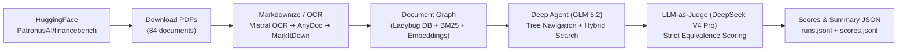

# financebench

Benchmarking a **Document Graph + agentic search** stack on
[FinanceBench](https://huggingface.co/datasets/PatronusAI/financebench) (Patronus AI).

The stack — built on [genai-tk](https://github.com/tclatos/genai-tk) and
[genai-graph](https://github.com/tclatos/genai-graph) — turns SEC filings
(10-K, 10-Q, 8-K, Earnings Releases) into a `Folder → Document → MarkdownSection` graph on an embedded
Ladybug (Kuzu/Cypher) database with native BM25 FTS and vector chunking. A Deep Agent answers financial
questions by **navigating** that graph with read-only tools (`get_folder_toc`, `get_document_toc`,
`get_section_content`, `search_sections`).


## Pipeline



## Quick Start

```bash
uv sync --extra harnessing        # DeepAgents SDK for the deep agent
just bench                        # full benchmark run: fetch → OCR/graph → run → grade
```

### Prerequisites

Create a `~/.env` file with required provider keys:
- `HF_TOKEN` — Hugging Face token (for dataset download)
- `MISTRAL_API_KEY` — for Mistral Document OCR
- `OPENROUTER_API_KEY` — for agent and judge LLM execution
- `DEEPINFRA_API_KEY` — for vector embeddings (e.g. Qwen3-0.6B)

OCR markdown is mirrored to `$ONEDRIVE/prj/financebench/markdown/` (or configured directory); all other runtime artifacts stay under `data/` (gitignored).

---

## Running the Benchmark

### Full Evaluation Run (All 84 Files, 150 Questions)

```bash
# Run the complete pipeline for active profile
cli bench run

# Run with a limit on questions (e.g. first 5 questions)
cli bench run -n 5

# Run for a specific profile (e.g. mistral_glm)
cli bench run -p mistral_glm

# Filter to specific documents with glob/pathspec patterns
cli bench run -f 'AMD*,BESTBUY*'
```

### Running Individual Stages

```bash
cli bench run --step fetch     # Download PDFs from Hugging Face
cli bench run --step build     # Convert PDFs to Markdown & build Document Graph
cli bench run --step run       # Execute Deep Agent across benchmark questions
cli bench run --step grade     # Grade agent responses with LLM-as-judge

# Or via just recipes:
just bench-fetch
just bench-build
just bench-run
just bench-grade
```

---

## Configuration & Trace Monitoring

Benchmark profiles and settings are configured in [config/bench.yaml](config/bench.yaml):

- **Document Conversion**:
  - `medium` profile uses `mistral_ocr` with 3 automatic exponential-backoff retries.
  - If Mistral OCR fails or is unavailable, it automatically falls back to **`anydoc`** (preferred over markitdown) and finally `markitdown`.
- **Trace Monitoring**:
  - Configurable via `monitoring:` in [config/bench.yaml](config/bench.yaml) or CLI flag `-m / --monitoring`:
    * `null` / `"none"` — tracing disabled (default)
    * `"langchain"` / `"langsmith"` — LangSmith cloud tracing
    * `"langfuse"` — LangFuse observability
    * `"local"` — local JSONL call logs in `data/traces/`
- **File Selection**:
  - `files.pathspecs: ["*"]` selects all 84 documents (150 questions) across the corpus.

```bash
# Run with LangSmith monitoring
cli bench run -m langchain

# Run with LangFuse monitoring
cli bench run -m langfuse
```

---

## Output Artifacts & Inspection

- **Question Runs**: `data/financebench/{profile}/runs.jsonl`
- **Grading Verdicts**: `data/financebench/{profile}/scores.jsonl`
- **Summary Metrics**: `data/financebench/{profile}/scores_summary.json`
- **Agent Trajectories**:
  ```bash
  cli trajectory list  # List all recorded agent execution trajectories
  ```

## Layout

```
financebench/bench/        # bench harness: run, flows, build_graph, run_questions, grade, fetch_pdf, load_dataset
financebench/commands/     # CLI commands: bench_commands, agent_commands
config/                    # bench.yaml, app_conf.yaml, agents.yaml, providers/
skills/custom/             # domain skills: financebench-qa, financial-ratios
report/                    # evaluation reports & analysis (PHASE1.md through PHASE6.md)
```
